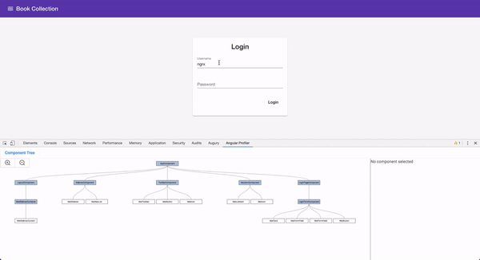
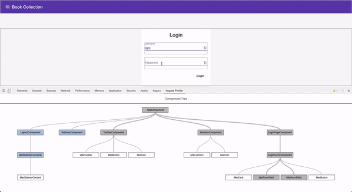
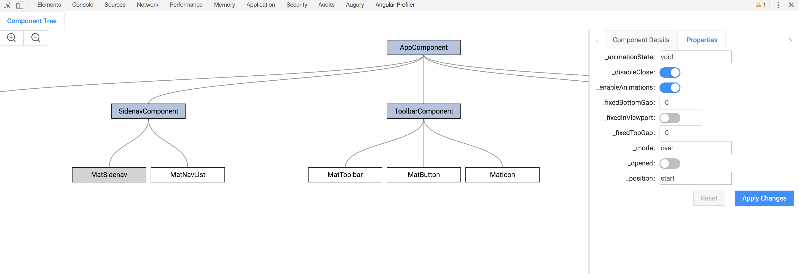

# Angular profiler

Angular Profiler is a developer tool to power-up Angular development workflow by providing a series of debugging tools.



## How it can help us having a better developing experience && building a faster application

### Visual Change Detection and Component Tree
Angular Profiler provides multiple ways to help us debugging over-triggered change detection in our Angular application.

#### 1. Highlight the components that triggered CD and indicate CD times with different colors.
 


#### 2. Visual detecting changes in a component tree  
The component tree will show you how angular components are rendered and updated



### Inspect and change component state
Select a component in the component tree, then you can see all the states of this component in the `properties` tab.
You can update the components right away without changing your codes and waiting webpack to compile to see your changes anymore.  
How awesome is that! :sunglasses:



> The Chrome extension is still under review, in the meanwhile, you can:
### Try it locally

```bash
// init project and install dependences
yarn
// package plugin in watch mode
yarn watch
// package and compile devtools page app in watch mode
yarn devtool-page:build:watch
```
The above commands will generate a `dist` folder that you can upload to chrome extension in development mode.
1. Go to `chrome://extensions/`
2. Turn on developer mode
3. Load unpacked `dist`
4. Enjoy a better developing experience :bowtie:!
5. Don't forget to send your feedback, all kinds of contributions are welcome.